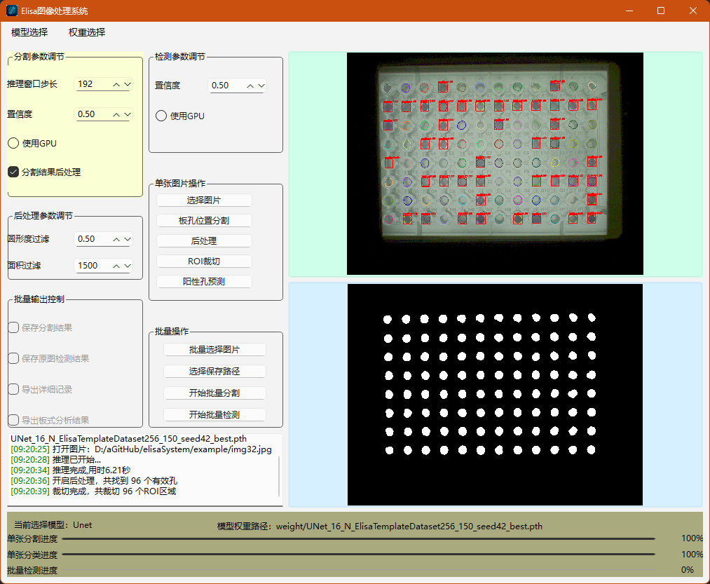

# ELISA图像处理系统


ELISA图像处理系统是一个基于深度学习的图像分割工具，专门用于处理ELISA（酶联免疫吸附测定）实验中的图像，自动识别和分析微孔板中的目标区域。

## 功能特点

- **深度学习模型支持**：支持U-Net和Attention U-Net等多种模型架构
- **图形用户界面**：基于PySide6的直观易用的GUI界面
- **批量处理**：支持批量处理多个图像文件
- **后处理优化**：提供形态学处理和目标筛选功能
- **结果可视化**：实时显示分割结果和原图叠加效果
- **ROI提取**：自动提取感兴趣区域用于后续分类任务
- **阳性孔分类**：新增基于ResNet的阳性/阴性孔分类功能

## 界面预览



## 系统要求

- Windows 10/11 (24H2版本测试通过)
- Python 3.8+

## 安装指南

1. 克隆项目代码：
```bash
git clone https://github.com/yourusername/elisaSystem.git
cd elisaSystem
```

2. 安装依赖：
```bash
pip install -r requirements.txt
```

3. 下载预训练模型权重文件并放置在`weight`目录下（详见"模型权重文件"部分）

## 模型权重文件

由于模型权重文件较大，未包含在Git仓库中。请从以下链接下载所需权重文件并放置在`weight`目录下：

- [UNet权重文件](https://example.com/unet_weights.pth) (示例链接)
- [Attention U-Net权重文件](https://example.com/attention_unet_weights.pth) (示例链接)

或者，您可以自己训练模型来生成权重文件。

## 使用说明

1. 运行主程序：
```bash
python ElisaSystem_main.py
```

2. 选择模型和权重文件：
   - 通过菜单栏选择模型类型（U-Net或Attention U-Net）
   - 选择对应的预训练权重文件

3. 单张图像处理：
   - 点击"打开单张图片"按钮选择图像
   - 调整参数（步长、置信度等）
   - 点击"分割"按钮开始处理

4. 批量处理：
   - 点击"打开多张图片文件夹"选择图像目录
   - 设置保存路径
   - 点击"开始批量推理"处理所有图像

5. 阳性孔分类：
   - 在完成图像分割后，点击"阳性孔分类"按钮
   - 选择预训练的分类模型权重文件
   - 系统将对提取的ROI区域进行阳性/阴性分类

## 项目结构

```
elisaSystem/
├── model/                  # 模型定义文件
│   ├── UNet.py            # U-Net模型实现
│   ├── attention_unet.py  # Attention U-Net模型实现
│   ├── fcn.py             # FCN模型实现
│   ├── r2unet.py          # R2U-Net模型实现
│   └── swinUnet.py        # Swin-Unet模型实现
├── weight/                 # 预训练模型权重文件（需手动下载）
├── output/                 # 训练输出目录
├── classificationDataset/  # 分类模型训练数据目录
├── ElisaSystem_main.py     # 主程序入口
├── inferThread.py          # 推理线程处理
├── postProcess.py          # 后处理功能
├── prepareClassification.py# ROI区域提取
├── classThread.py          # 阳性孔分类线程
├── predict.py              # 分类模型推理脚本
├── multi_classification_framework.py  # 分类模型训练框架
├── classes.json            # 分类类别定义文件
└── overlay_mask_on_image.py# 结果可视化
```

## 技术细节

### 模型架构

- **U-Net**：经典的图像分割架构，包含编码器-解码器结构和跳跃连接
- **Attention U-Net**：在U-Net基础上引入注意力机制，提高分割精度
- **FCN**：全卷积网络，支持FCN-8s、FCN-32s等多种变体
- **R2U-Net**：基于递归残差结构的U-Net变体，具有更好的特征提取能力
- **Swin-Unet**：基于Swin Transformer的U-Net架构，结合了Transformer的全局建模能力和U-Net的局部特征提取能力
- **ResNet**：用于阳性/阴性孔分类的深度残差网络

#### U-Net

经典的U-Net模型采用编码器-解码器结构，通过跳跃连接将编码器的特征图与解码器对应层级的特征图进行融合，能够有效保留图像的细节信息。适用于医学图像分割任务。

#### Attention U-Net

在经典U-Net的基础上引入了注意力门控机制，在跳跃连接处使用注意力块对编码器的特征进行加权，使模型能够关注更重要的特征区域，提高分割精度。

#### FCN (Fully Convolutional Network)

全卷积网络，将传统CNN的全连接层替换为卷积层，使网络能够接受任意尺寸的输入图像。支持FCN-8s和FCN-32s等多种变体，通过不同层级的特征融合实现更精确的分割。

#### R2U-Net

基于递归残差结构的U-Net变体，使用递归卷积块替代传统卷积，通过多次迭代增强特征表达能力，对医学图像分割具有更好的效果。

#### Swin-Unet

基于Swin Transformer的U-Net架构，编码器和解码器使用Swin Transformer块替代传统卷积块，结合了Transformer的全局建模能力和U-Net的局部特征提取能力，在多种图像分割任务中表现出色。

### 图像处理流程

1. 图像预处理和滑动窗口分割
2. 深度模型推理
3. 结果融合和二值化
4. 后处理优化（可选）
5. ROI区域提取（可选）
6. 阳性孔分类（可选）

### 后处理功能

- 形态学去噪
- 面积阈值筛选
- 圆形度筛选
- 目标数量限制

### 阳性孔分类功能

新增的阳性孔分类功能基于ResNet模型，可以将提取的ROI区域分为"positive"（阳性）和"negative"（阴性）两类。该功能包括：

- 独立的分类模型训练框架
- 支持多种预训练模型（通过timm库）
- 可视化分类结果
- 支持置信度阈值设置
- 批量处理能力

## 贡献指南

欢迎提交Issue和Pull Request来改进这个项目。

## 许可证

本项目采用MIT许可证，详情请见[LICENSE](LICENSE)文件。

## 联系方式

如有问题，请提交Issue或联系项目维护者。